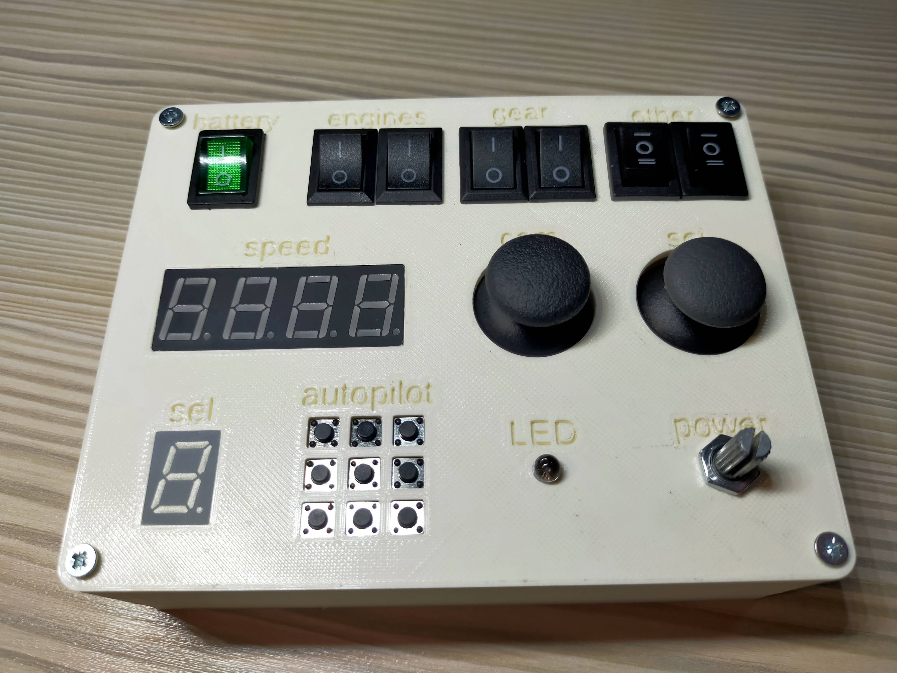
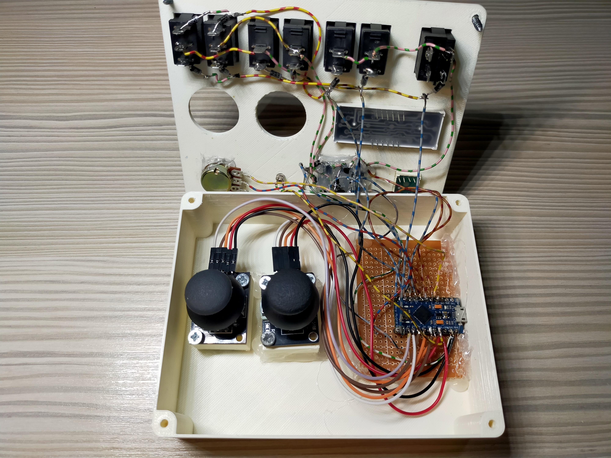

# SCAD-buttonTable
This project uses SCAD to generate a 3D model of a panel with a lot of buttons, switches, potentiometers,joysticks, displays etc.
<li>example:
</img>

## How to modify?
Just change the variables on the top of the file.

<ul>
<li> $fn - corresponds to the detail level of curves. Makes the text and round stuff look smoother ,but can make the project lag. Set it high before rendering the model. 100 should be good.
<li> panelWidth, panelHeight, panelThicknes - main body size
<li> screwDiamter - how big are the holes on the sides
<li> roundCornerRadious - how smooth the corners are
<li> border - how big the margins from edges to the holes (buttons and other stuff) are
<li> gridSizeX, gridSizeY - how big the distance between all the stuff is
<li> textSize - how big the labels are
<li> labelsEnabled 
<li> isLabelPositive - do the labels go into the plate or above it
<li> numberOfGridsInARowX, numberOfGridsInARowY - how many things to have vertically and horizontally

<li> map - tells the program where to put all of the components. Just play with it and figure it out
<li> labelMap - should be the same size as the "map" variable. Tells the program how to label each cell. The first thing in the "map" array corresponds to the first thing in the "labelMap"
</ul>

## How to export?
in OpenSCAD press F6 to render the panel. This may take a while because OpenSCAD is really slow. Then pres F7 to export it as a STL file.

## How to put in the parts?
All of the holes are the same size as the parts. That means they are gonna sit there without any glue, using only friction. If you have any problems fitting something in, take a knife or anything sharp and scrape the edges from the bottom. 

## How to wire it up?
if you have a lot of buttons or switches you can wire them up into a grid. It might look intimidating but it's accualy quite simple.
</img>
